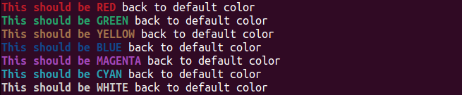

This small package is intended to allow printing **colored** text for **C++** console application.

Before doing anything else, leave a **star** to this project ;).

What you would see from the console using this package:



It is cross-platform and all the functionalities are contained in [**ColoredStream.hpp**](./src/ColoredStream/ColoredStream.hpp).

The ability to show a colored text is made possible by building and printing a **ColoredStream** object.
**ColoredStream** extends **std::stringstream** adding the possibility to show colored text.
Such ability is enabled when passing a **ColoredStream** instance to a **std::cout** for printing something into the console. On the opposite, when passing a **ColoredStream** instance to another kind of output stream, like for instance a **std::ofstream**, the object behaves like a normal **std::stringstream**, printing normal text.

**ColoredStream** is able to handle 3 possible color prescriptions:
 - specify classical colors like **red** or **yellow**
 - specify a [8-bit color](https://en.wikipedia.org/wiki/ANSI_escape_code) code 
 - specify a [R,G,B](https://en.wikipedia.org/wiki/ANSI_escape_code) triplet 

**ColoredStream** is also able to apply a specific background color:


The kind of color used for specifying the text (R,G,B triplet, 8-bit code, etc...) can be different from the one used for the background.

## EXAMPLES

Still haven't left a **star**? Do it now!! ;).

Using this package is straightforward: you just need to create a **ColoredStream** object and then pass it to std::cout for print it.
Suppose for example you want to display a red colored hello world, all you need to do would be this:

```cpp
#include <ColoredStream/ColoredStream.hpp>
using namespace colored_stream;

std::cout << ColoredStream{RED, "Hello world"} << std::endl;
```


and that's it!

You can create an empty ColoredStream instance, whose content is created step by step, before printing it:

```cpp
ColoredStream colored_content(RED);
colored_content << "Hello ";
colored_content << "World ";
colored_content << " :-)";

std::cout << colored_content << std::endl;
```


... or, you can pass a variadic number of inputs in order to build the object in place:

```cpp
std::cout << ColoredStream{BLUE, "Hello ", "World ", " :-)"} << std::endl;
```


You can also prescribe the background color:

```cpp
ColoredStream stream{RED, "Hello World"};
stream.setBackground(Uint8Color{11});
std::cout << stream << std::endl;
```


## CMAKE SUPPORT

You can fetch this package and link to the **ColoredStream** library, that is actually just a **INTERFACE** library exposing the position of [**ColoredStream.hpp**](./src/ColoredStream/ColoredStream.hpp):

```cmake
include(FetchContent)
FetchContent_Declare(
colored_stream
GIT_REPOSITORY https://github.com/andreacasalino/ColoredStream.git
GIT_TAG        main
)
FetchContent_MakeAvailable(colored_stream)
```
and then link the **INTERFACE** library to the package that needs to consume it:

```cmake
target_link_libraries(${LIB_NAME}
    ColoredStream
)
```